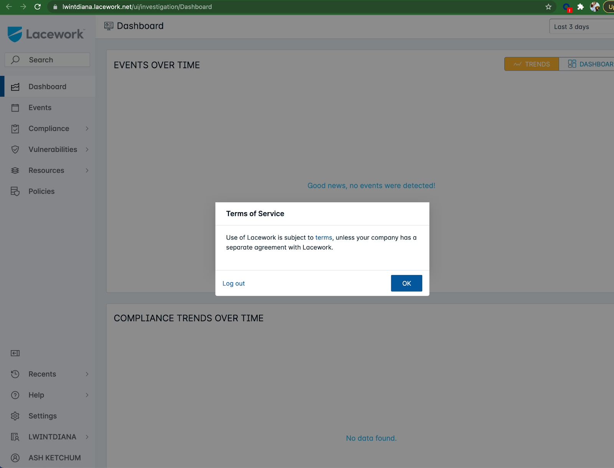
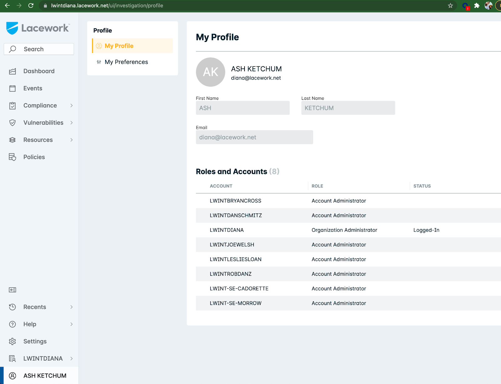

# **Okta Identity Provider** <!-- omit in toc -->

This guide describes the Okta requirements to achieve JIT auth with Lacework.

## Table of contents

- [Best practices](#best-practices)
- [Steps](#steps)
- [Additional resources](#additional-resources)

## Best practices

* Use the [Okta Terraform provider](https://registry.terraform.io/providers/okta/okta/latest/docs).
* Use the identity provider metadata XML file to minimize human error. See [example-metadata.xml](example-metadata.xml).

## Steps

### **1**. Review [best practices](../../README.md#best-practices) and [prerequisites](../../README.md#prerequisites). <!-- omit in toc -->
  - You may sign up for a free Okta Trial [here](https://www.okta.com/free-trial/customer-identity/). After activating the trial, head to https://`<YOUR_ORG>`-admin.okta.com/admin/access/api/tokens to create a token. Securely store the token value. 

### **2**. Configure Okta (via Terraform). <!-- omit in toc -->

Note: If you do not have Terraform installed, follow your OS-specific installation instructions in [this](https://learn.hashicorp.com/tutorials/terraform/install-cli#install-terraform) page.

Note: The full example can be found [here](example-lw+okta.tf). 

* **2A**. Gather the Lacework organization name. This is typically the company name, e.g., MongoDB. In this example, the Lacework organization name is `lwintdiana` and this has been set in the `terraform.tfvars` file. Refer to [terraform.tfvars.example](terraform.tfvars.example) for required variables.

  ```terraform
    # Please fill in the values for all the variables here
    okta_api_token = "ABCDE_123ABC123ABC123ABC123ABC123ABC123ABC"
    okta_base_url = "okta.com"
    okta_org_name = "dev-1234567"


    lw_org_name = "lwintdiana"
  ```

* **2B**. Add a Security Assertion Markup Language (SAML) application by creating a `okta_app_saml` resource. The name and label of the resource are flexible. In the example below, we use `lacework-okta-demo`. 
    ```terraform
      provider "okta" { 
        api_token = var.okta_api_token
        base_url = var.okta_base_url
        org_name = var.okta_org_name
      }

      resource "okta_app_saml" "lacework-okta-demo" {
        lifecycle {
        ignore_changes = [users]
      }
        label                    = "lacework-okta-demo"
        status                   = "ACTIVE"
        sso_url                  = format("https://%s.lacework.net/sso/saml/login", var.lw_org_name)
        recipient                = format("https://%s.lacework.net/sso/saml/login", var.lw_org_name)
        destination              = format("https://%s.lacework.net/sso/saml/login", var.lw_org_name)
        audience                 = "https://lacework.net"
        subject_name_id_template = "$${user.userName}"
        subject_name_id_format   = "urn:oasis:names:tc:SAML:1.1:nameid-format:emailAddress"
        response_signed          = true
        signature_algorithm      = "RSA_SHA256"
        digest_algorithm         = "SHA256"
        honor_force_authn        = false
        authn_context_class_ref  = "urn:oasis:names:tc:SAML:2.0:ac:classes:PasswordProtectedTransport"

        user_name_template = "$${source.email}"
        user_name_template_type = "BUILT_IN"

      attribute_statements {
        
        type         = "EXPRESSION"
        name         = "First Name"
        namespace = "urn:oasis:names:tc:SAML:2.0:attrname-format:unspecified"
        values = [ "user.firstName" ]
      }
      attribute_statements {
        type         = "EXPRESSION"
        name         = "Last Name"
        namespace = "urn:oasis:names:tc:SAML:2.0:attrname-format:unspecified"
        values = [ "user.lastName" ]
      }
      attribute_statements {
        type         = "EXPRESSION"
        name         = "Company Name"
        namespace = "urn:oasis:names:tc:SAML:2.0:attrname-format:unspecified"
        values = [ "user.company" ]
      }
      attribute_statements {
        type         = "EXPRESSION"
        name         = "Lacework Admin Role Accounts"
        namespace = "urn:oasis:names:tc:SAML:2.0:attrname-format:unspecified"
        values = [ "user.laceworkAdminRoleAccounts" ]
      }
      attribute_statements {
        type         = "EXPRESSION"
        name         = "Lacework User Role Accounts"
        namespace = "urn:oasis:names:tc:SAML:2.0:attrname-format:unspecified"
        values = [ "user.laceworkUserRoleAccounts" ]
      }
      attribute_statements {
        type         = "EXPRESSION"
        name         = "Lacework Organization Admin Role"
        namespace = "urn:oasis:names:tc:SAML:2.0:attrname-format:unspecified"
        values = [ "user.laceworkOrgAdminRole" ]
      }
      attribute_statements {
        type         = "EXPRESSION"
        name         = "Lacework Organization User Role"
        namespace = "urn:oasis:names:tc:SAML:2.0:attrname-format:unspecified"
        values = [ "user.laceworkOrgUserRole" ]
      }
    }
    ```

* **2C**. Add custom Lacework attributes to a profile. If you have a specific profile attached to each application, add the attributes to the application user profile as shown  below. 
    ```terraform
    # App user schema custom attributes
    resource "okta_app_user_schema_property" "company" {
      app_id      = okta_app_saml.lacework-okta-demo.id
      index       = "company"
      title       = "Company"
      type        = "string"
      master      = "PROFILE_MASTER"
      scope       = "NONE"
    }
    resource "okta_app_user_schema_property" "laceworkAdminRoleAccounts" {
      app_id      = okta_app_saml.lacework-okta-demo.id
      index       = "laceworkAdminRoleAccounts"
      title       = "Lacework Admin Role Accounts"
      type        = "string"
      master      = "PROFILE_MASTER"
      scope       = "NONE"
    }
    resource "okta_app_user_schema_property" "laceworkUserRoleAccounts" {
      app_id      = okta_app_saml.lacework-okta-demo.id
      index       = "laceworkUserRoleAccounts"
      title       = "Lacework User Role Accounts"
      type        = "string"
      master      = "PROFILE_MASTER"
      scope       = "NONE"
    }
    resource "okta_app_user_schema_property" "laceworkOrgAdminRole" {
      app_id      = okta_app_saml.lacework-okta-demo.id
      index       = "laceworkOrgAdminRole"
      title       = "Lacework Organization Admin Role"
      type        = "boolean"
      master      = "PROFILE_MASTER"
      scope       = "NONE"
    }
    resource "okta_app_user_schema_property" "laceworkOrgUserRole" {
      app_id      = okta_app_saml.lacework-okta-demo.id
      index       = "laceworkOrgUserRole"
      title       = "Lacework Organization User Role"
      type        = "boolean"
      master      = "PROFILE_MASTER"
      scope       = "NONE"
    }
    ```
    If you do not have a specific profile attached, add the Lacework attributes to the Okta profile as shown below. 
    ```terraform
    # Okta user schema custom attributes
    resource "okta_user_schema_property" "company" {
      index       = "company"
      title       = "Company"
      type        = "string"
      master      = "PROFILE_MASTER"
      scope       = "NONE"
    }
    resource "okta_user_schema_property" "laceworkAdminRoleAccounts" {
      index       = "laceworkAdminRoleAccounts"
      title       = "Lacework Admin Role Accounts"
      type        = "string"
      master      = "PROFILE_MASTER"
      scope       = "NONE"
    }
    resource "okta_user_schema_property" "laceworkUserRoleAccounts" {
      index       = "laceworkUserRoleAccounts"
      title       = "Lacework User Role Accounts"
      type        = "string"
      master      = "PROFILE_MASTER"
      scope       = "NONE"
    }
    resource "okta_user_schema_property" "laceworkOrgAdminRole" {
      index       = "laceworkOrgAdminRole"
      title       = "Lacework Organization Admin Role"
      type        = "boolean"
      master      = "PROFILE_MASTER"
      scope       = "NONE"
    }
    resource "okta_user_schema_property" "laceworkOrgUserRole" {
      index       = "laceworkOrgUserRole"
      title       = "Lacework Organization User Role"
      type        = "boolean"
      master      = "PROFILE_MASTER"
      scope       = "NONE"
    }
    ```

* **2D**. [Optional] Prepare to test the configuration. We’ll add a test user to Okta and grant them access to the Lacework application. Make sure to use a valid email because we’ll need to activate this user. The test occurs at the end of step 3 as it requires the Lacework platform to be configured.
   - Add a test user and grant them access to the Lacework application.
       
     ```terraform
      # [OPTIONAL] Add a Okta User for testing 
      resource "okta_user" "demo_okta_user" {
        first_name = "Ash"
        last_name  = "Ketchum"
        login      = "diana@lacework.com"
        email      = "diana@lacework.com"
      }

      # [OPTIONAL] Grant the test user access to the Lacework Application
      resource "okta_app_user" "demo_lw_user" {
        app_id   = okta_app_saml.lacework-okta-demo.id
        user_id  = okta_user.demo_okta_user.id
        username = "diana@lacework.com"
        profile  = "{ \"company\" : \"Oak's Laboratory\", \"laceworkOrgAdminRole\" : true }"
      }
      ```
    
* **2E**. Apply all the changes:
    * In the terminal, run `terraform apply`.
    * Confirm with `yes`. 

* **2F**. Obtain the Okta app's metadata XML

    ```terraform
    output "xml" {
      value = okta_app_saml.lacework-okta-demo.metadata
    }
    ```
    
* **2G**. Download the metadata locally. 

  Note: Refer to [example-metadata.xml](example-metadata.xml) to see what the XML file looks like.

  Note: This example uses [jq](https://stedolan.github.io/jq/) to obtain the XML file:
    ```bash
    terraform refresh
    terraform output -json | jq  .xml.value -r > example-metadata.xml
    ```

### **3**. Configure Lacework (via the user interface). <!-- omit in toc -->
As per the current limitations, only one auth mode can be enabled. Ensure you’ve disabled all auth configurations before continuing.  

* **3A**. Open https://YOUR-ORG.lacework.net/ui/investigation/settings. 
* **3B**. Navigate to the “Authentication” page.
* **3C**. If you have an existing Okta SAML auth configured and want to change it to allow for JIT, follow these instructions:

    * To update: 
        * Check existing SAML.
        * Click **Edit.**
        * Select **Upload identity provider data.**
        * Name it **Okta**.
        * Browse and upload metadata file.
        * Enable **Just-In-Time User Provisioning**.
        * Click **Save.**
    
    * To create:
      * Click **Create New.**
      * Select **SAML**.
      * Select **Upload identity provider data.**
      * Name it **Okta_._**
      * Browse and upload metadata file.
      * Enable **Just-In-Time User Provisioning**.
      * Click **Save.**
    
* **3D**. [Optional] Test Okta SAML JIT.
   - Activate the test user's Okta account. 
      -  Open the test user’s inbox and select the **Welcome to Okta!** email. Click the **activation** button. This will redirect you to create a password.
    - Log in to the Lacework platform with the test user's credentials. It may take a few seconds for the profile to create, but once that completes, the test user has access to the platform. 
    - Refer to the screenshots below to compare what the test user should see.




## Appendix
### Additional resources

* [Okta SAML IDP](https://docs.lacework.com/okta-as-a-saml-idp)
* [SAML JIT Overview](https://docs.lacework.com/saml-jit-overview) 
* [SAML Configuration](https://docs.lacework.com/saml-configuration) 
